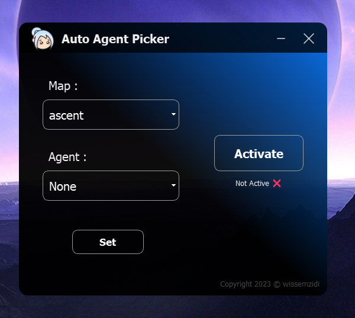
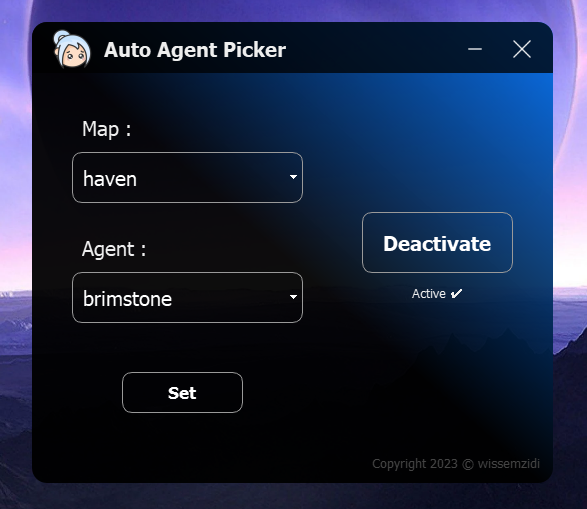

# Read Me

## [👀 Preview]


<table>
  <tr>
    <td valign="top"></td>
    <td valign="top"></td>
  </tr>
</table>

---

### Table of Contents 👋

- [Description 📄](#description)
- [How To Use 📙](#how-to-use)
- [References ](#references)
- [License ](#license)
- [Author Info ✆](#author-info)

---

## Description

Introducing Valorant Auto Agent Picker Alpha Release

Hello there, **Auto Agent Picker** is a cutting-edge tool designed to enhance your gaming experience and streamline agent selection. Say goodbye to the dilemma of coordinating agent choices with your friends before a match. With the Auto Agent Picker, you're in control of your destiny in the Valorant universe.

#### Technologies 

- ## Python3

[Back To The Top](#read-me)

---

## How To Use

download the latest <a href="https://github.com/wissemzidi/Agent-Auto-Picker-valorant/releases">RELEASE</a> package and extract it then launch the .exe file an Enjoy 👌

#### Installation 

No Installation required just extract the <a href="https://github.com/wissemzidi/Agent-Auto-Picker-valorant/releases">RELEASE</a> package and **Thats It**

#### API Reference 

```html
<p>⚙️⚙️⚙️ Coming Soon ⚙️⚙️⚙️</p>
```

[Back To The Top](#read-me)

---

## References

[Back To The Top](#read-me)

---

## License

MIT License 

Copyright (c) 2022 Wissem Zidi

Permission is hereby granted, free of charge, to any person obtaining a copy
of this software and associated documentation files (the "Software"), to deal
in the Software without restriction, including without limitation the rights
to use, copy, modify, merge, publish, distribute, sublicense, and/or sell
copies of the Software, and to permit persons to whom the Software is
furnished to do so, subject to the following conditions:

The above copyright notice and this permission notice shall be included in all
copies or substantial portions of the Software.

THE SOFTWARE IS PROVIDED "AS IS", WITHOUT WARRANTY OF ANY KIND, EXPRESS OR
IMPLIED, INCLUDING BUT NOT LIMITED TO THE WARRANTIES OF MERCHANTABILITY,
FITNESS FOR A PARTICULAR PURPOSE AND NONINFRINGEMENT. IN NO EVENT SHALL THE
AUTHORS OR COPYRIGHT HOLDERS BE LIABLE FOR ANY CLAIM, DAMAGES OR OTHER
LIABILITY, WHETHER IN AN ACTION OF CONTRACT, TORT OR OTHERWISE, ARISING FROM,
OUT OF OR IN CONNECTION WITH THE SOFTWARE OR THE USE OR OTHER DEALINGS IN THE
SOFTWARE.

[Back To The Top](#read-me)

---

## Author Info

#### Created By Wissem Zidi 

- [Website ](https://wissem-zidi-ofc.netlify.com)
- [Email ](https://mail.google.com/mail/u/0/?fs=1&tf=cm&source=mailto&to=wissem.zidi.contact@gmail.com)
- [Github ](https://github.com/wissemzidi/)

[Back To The Top](#read-me)

**Have a nice day!** 🚀
